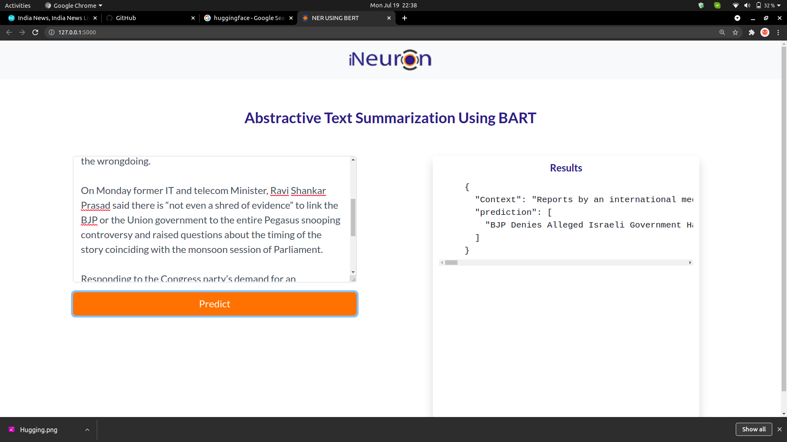
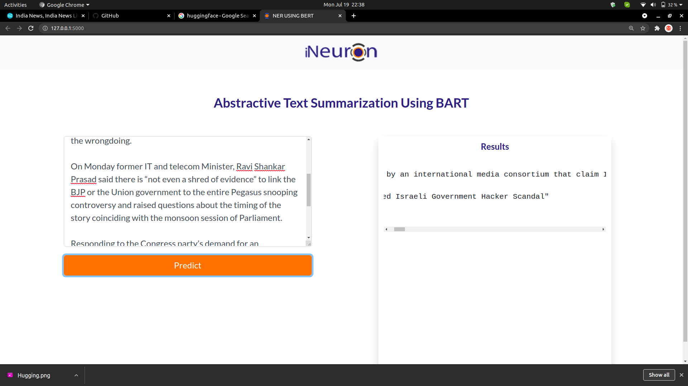

## Abstractive Summarization using BART (Facebook)
### Prediction on the Todays News
#### Give the response within **5 seconds**

## **Text Summarization Using BART (LARGE)**

**Data Collection:** Here we are using Cryto News dataset which having Complete News of various domain like Politics , Sport, Finace etc. It is in English language. It has 1.5 Millions Records & with the help of LabelStudio we have done the Labeling the Summarization using QuillBots.
**Data Cleaning:** For data cleaning we are try handle the fullstop. & we are passing the sentence having fullstop.
Model Building: Generally For Model building we need high RAM & Better Instance, so we have tested with two plateform:
    1. Datacrunch.io
    2. Paperspace
we have trained the data upto 25 epochs & we are getting Validation Loss == 0.09
**Dynamic Quantization:**  We are getting the Model having size 1.6 Gb which is Pretty large so we are applying th Dynamic Quantization on the Dense layers having dataType of Float32 ==> qint8
Then we saving the Quantized Model for Inferences with 2% decrement in performance with 3 times faster in Loading & Inferences.

**Model Deployment:** Then we are try to deploy this model into the ServerLess Engine (CloudRun) GCP with Dockerization.
